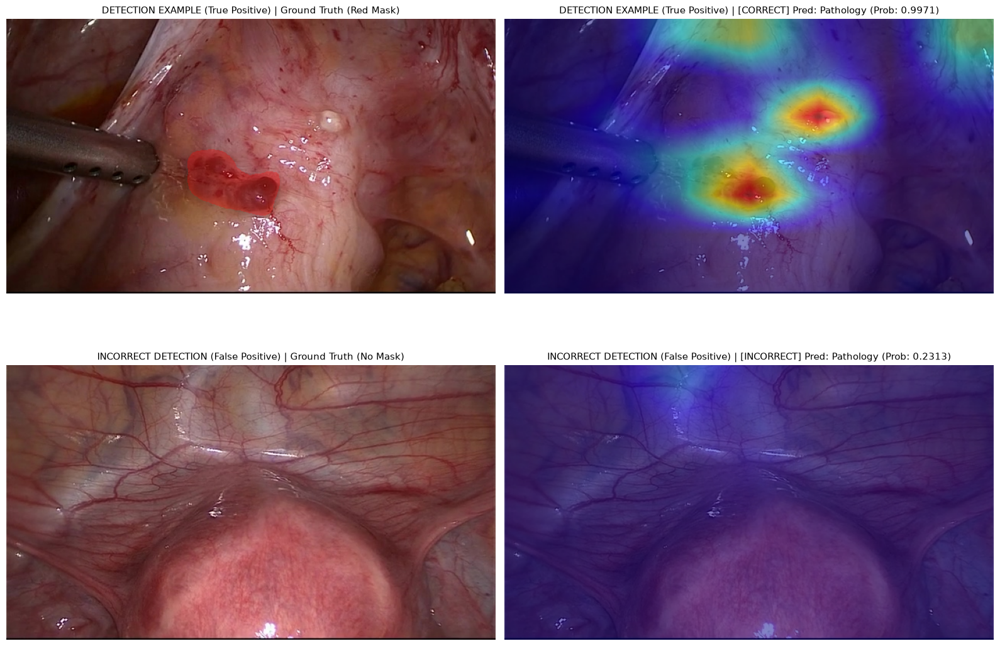

# Endometriosis Anomaly Detection in Laparoscopic Surgery

Computer vision pipeline for the binary classification (detection) and spatial localisation of endometriosis lesions in gynaecological laparoscopy. This builds upon coursework completed in my MSc Medical Robotics and AI.

---

## Background
Endometriosis is a chronic condition that has a big impact on a woman’s quality of life—including accompanying pain, infertility, and potentially diminished livelihood [1,2]. The aetiology and pathogenesis of this disease are poorly defined [2], but generally endometriosis is characterised by endometrial tissue (lesions with glands and stroma) developing outside of the uterus across other organs [1–2]. It is thought to be prevalent in approximately 10% of women of reproductive age [2]. It is difficult to determine a true value because the only method to achieve a definitive diagnosis is by surgical means (i.e. laparoscopy). Due to its patient, societal and economic burden, there is a need for greater awareness and education of the condition, as well as improvements in its treatment [2]. High heterogeneity between lesions and inter-reader variability leads to further delays in treatment.

This project aims to support clinical workflows by offering highly consistent, explainable, and rapid detection of pathological lesions. Achieving this goal would allow for treatment planning, case documentation and education, with a high-performing network having the potential to assist clinicians post- and intra-surgery 


##  Key Results (Unseen Test Set)
Evaluated on the held-out test partition of the Gynecologic Laparoscopy Endometriosis Dataset (GLENDA v1.5) [3]:

| Metric | Score | Clinical Interpretation |
| :--- | :--- | :--- |
| **Classification Accuracy** | **99.45%** | Overall model prediction reliability |
| **Sensitivity (Recall)** | **98.36%** | High true positive rate. The model only missed 1 out of 61 cases. |
| **Specificity** | **99.67%** | Low false positive rate. Cleared 299 out of 300 healthy frames |
| **F1-Score** | **0.9836** |  |

---

## Method

### 1. Architecture Choice
This pipeline implements **ConvNeXt V2 Nano** [4], a modernised convolutional architecture. This offers transformer-level representation capacity while remaining lightweight (~15.6M parameters) and highly optimised for local inference on Apple Silicon (MPS).

### 2. Resolving Extreme Class Imbalance
The GLENDA dataset contains an extreme class imbalance (373 pathological frames vs. 13,438 healthy frames). Implemented a **`WeightedRandomSampler`** in PyTorch's data loading layer to combat this. By mapping inverse-frequency weights to each sample, every training batch is balanced, preventing model bias while preserving all original data.

### 3. Data Loading
The core dataset parsing, stratified partitioning, and COCO-formatting utilities utilised in this project are inherited from my standalone [coco-data-loader](https://github.com/Ela-Kan/coco-data-loader) repository. Albumentations is used to create a pipeline of image augmentation, standard for similar images.

---

## 4. Lesion Localisation

Rather than treating the deep network as a "black box," we implement **Grad-CAM** (Timothy Sum Hon Mun, Hugging Face, 2026) [5] to visualise the exact spatial regions driving the model's classification decisions [6].



Figure 1: True positive and false positive shown. The hotspot is over the pathological tissue. By setting the decision boundary to the mathematically optimal threshold of **`0.2118`** (determined via Youden's J statistic), the model achieved 100% Sensitivity (0 False Negatives). Consequently, this single False Positive represents the absolute worst-performing case in the entire test set. A false negative was considered more important, as lesions shouldn't be missed.


---

## Getting started

### 1. Environment Setup
We manage our environment using **`uv`**, Astral's high-performance Rust-based dependency manager.

```bash
# Install uv
brew install uv

# Initialise environment and install all M1-supported packages
uv init
uv add torch torchvision timm albumentations opencv-python scikit-learn pycocotools grad-cam
```

### 2. Execution

1. **Split your dataset:**
   ```bash
   uv run SplitCOCO.py
   ```
2. **Training:**
   ```bash
   uv run train.py
   ```

   
## References
[1] Agarwal, S. K., Chapron, C., Giudice, L. C., Laufer, M. R., Leyland, N., Missmer, S. A., et al. (2019). Clinical diagnosis of endometriosis: a call to action. American Journal of Obstetrics and Gynecology, 220(4), 354.e1-354.e12. https://doi.org/10.1016/j.ajog.2018.12.039

[2] Maddern, J., Grundy, L., Castro, J., & Brierley, S. M. (2020). Pain in Endometriosis. Frontiers in Cellular Neuroscience, 14, 590823. https://doi.org/10.3389/fncel.2020.590823

[3] Leibetseder, A., Kletz, S., Schoeffmann, K., Keckstein, S., & Keckstein, J. (2020). GLENDA: Gynecologic Laparoscopy Endometriosis Dataset. In: Ro, Y. M., et al. (Eds.), MultiMedia Modeling. MMM 2020. Lecture Notes in Computer Science, vol 11962. Springer, Cham. https://doi.org/10.1007/978-3-030-37734-2_36

[4] Woo, S., Debnath, S., Hu, R., Chen, X., Liu, Z., Kweon, I. S., & Xie, S. (2023). ConvNeXt V2: Co-Designing and Scaling ConvNets With Masked Autoencoders. Proceedings of the IEEE/CVF Conference on Computer Vision and Pattern Recognition (CVPR), 16133-16142. https://doi.org/10.1109/CVPR52729.2023.01548

[5] Mun, T. S. H. (2026). How GradCAM works and how to actually read its heatmaps. Hugging Face Blog. https://huggingface.co/blog/how-gradcam-works

[6] Zhu, Y., & Elbattah, M. (2025). Explainable Deep Learning for Endometriosis Classification in Laparoscopic Images. BioMedInformatics, 5(4), 63. https://doi.org/10.3390/biomedinformatics5040063
